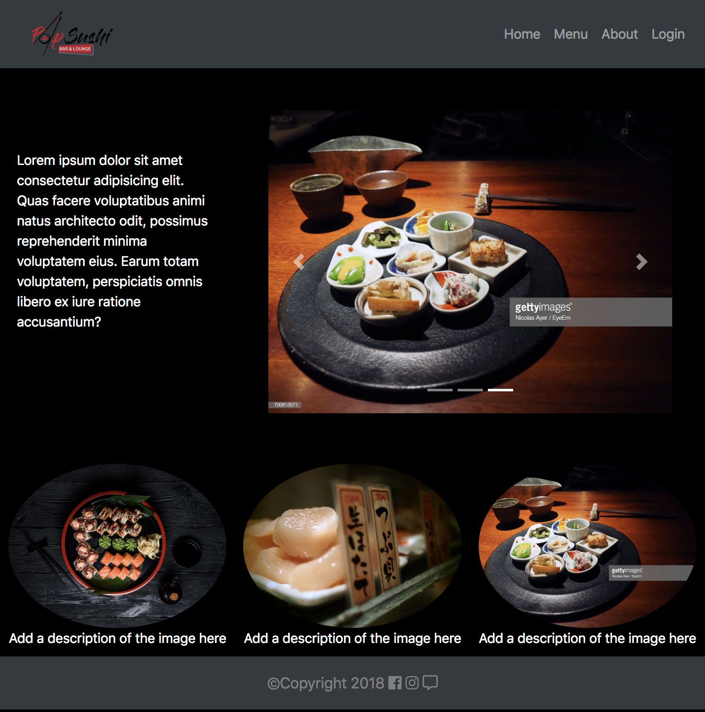
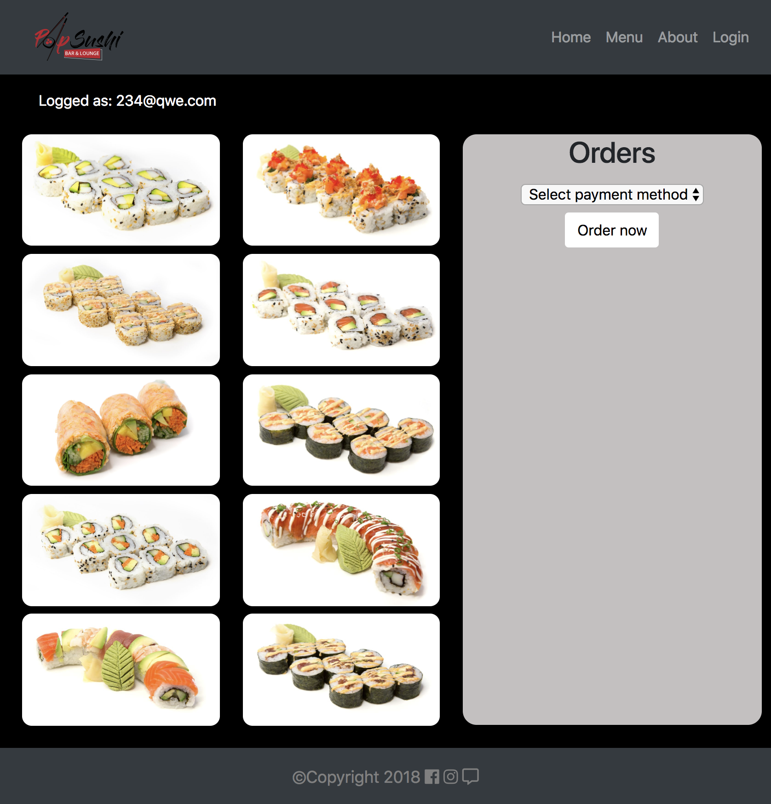
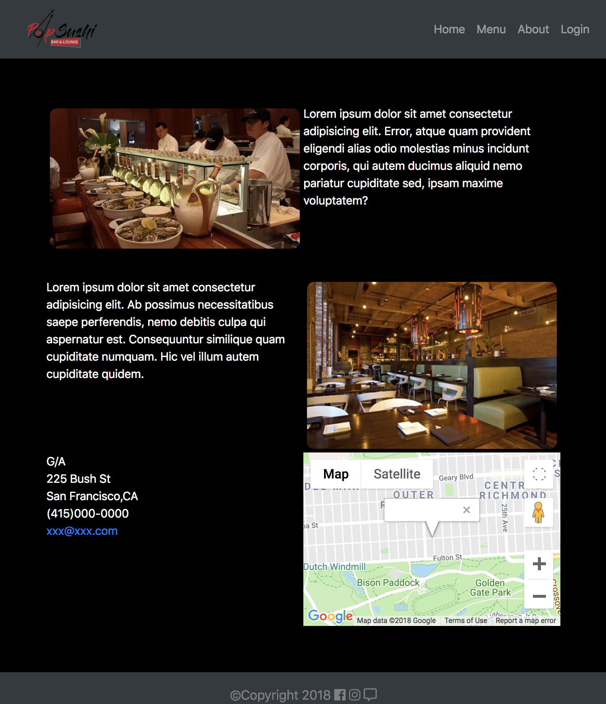
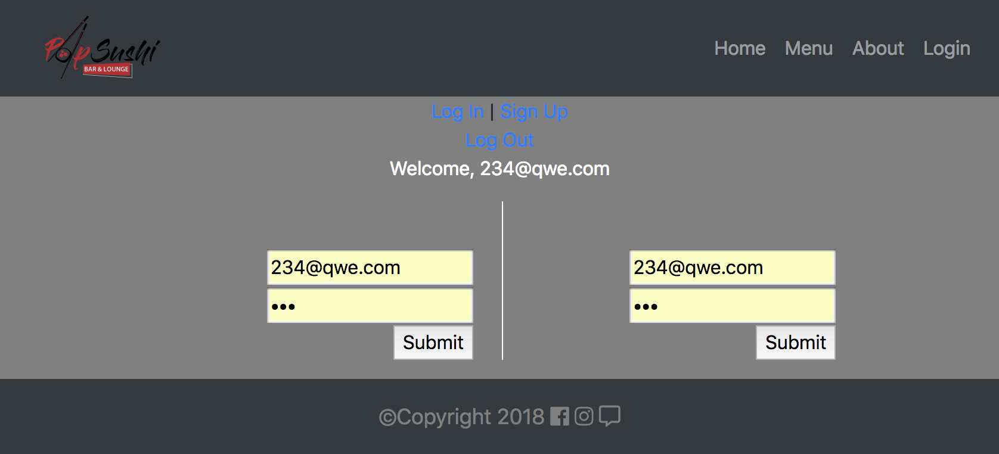
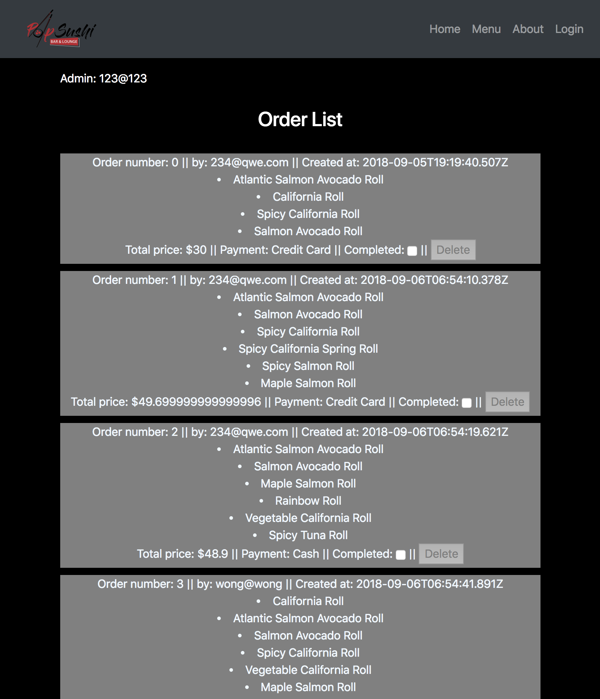

# Restaurant App
We decided to solve a Entry level web developer job challange. The main advantage of this app is that it is not heavily reliant on a external API. Here is the premise:

    Functional requirements:

    - Logging with company mail.

    - Manage information of employees (3 types: admin, cashier and chef).

    Roles:

    ATM

    - Register orders (list of dishes ordered by customer)

    Chef

    - Mark orders as ready

    Admin
    - Cash flow

    - View orders and their states

    - Orders Report

    Characteristics of the Orders
    State (Command, In process, Completed)
    They must have the client's name
    Date and time of creation of the order
    Type of Payment of the order (Card or Cash)
    Total amount of the order
    Order detail (list of dishes, each with its price)
    In addition to the application in Ruby on Rails you must enable an API and create a web application in AngularJS or ReactJS to which you can only enter the admin and can see the list of employees (system users) and orders (with their respective characteristics) ).

## 1: Express API
We hard coded our API, which was basically our dishes. To do that, first we coded our Dishes Schema:

``` javascript

    const orderSchema = new Schema({
        _user: {
            type: Schema.Types.ObjectId,
            ref: ‘User’
        },
        dishes: [{
            type: Schema.Types.ObjectId,
            ref: ‘Dish’
        }],
        paymentMethod: String,
        totalPrice: Number
    });

```

``` javascript

    const dishSchema = new Schema({
        name: String,
        completed: Boolean,
        price: Number,
        description:String, //Customer specifications
        image: String
    });

```
We then proceeded to write our seed.js. We took the dishes from Bento sushi restaurant.

## 2: CRUD
Users can order once they are logged in. When they click on menu, the name, price, description and image of dishes will be loaded. An order belongs to only a user, but it can contain many/ any combination of dishes.

``` javascript

    const userSchema = mongoose.Schema({
    email: { 
        type: String, 
        required: true, 
        unique: true
    },
    password: { type: String, required: true , select: false},
    isAdmin: Boolean
})
```

## 3:AJAX
Most of the AJAX request were directed to our database to fill our menu (which is the function below) as well as the Admin page. Don't let this huge function surprise you, what is mostly doing is just appending html code when ajax is successfuly executed. The Admin is able to track orders, see the cash flow, see user who order it, check whether is completed or not and delete the completed orders.

``` javascript

    function getOrders(){
            $.ajax({
                method: "GET",
                url: 'http://localhost:3000/api/orders',  
                success: function (json){
                    for(let i = 0; i < json.data.length ; i++){
                        $("#ControlList").append(   `<div class="Ord" id="number${i}" style="border-bottom: 10px solid black;">
                                                        Order number: ${i} || by: ${json.data[i]._user.email} || Created at: ${json.data[i].createdAt}
                                                        <div id="order-${i}"></div>
                                                    </div>`);
                        for(let j = 0; j < json.data[i].dishes.length ;j++){
                            $(`#order-${i}`).append(`<li>${json.data[i].dishes[j].name}</li>`);
                        }
                        $(`#number${i}`).append(`Total price: $${json.data[i]                             .totalPrice} ||
                                                Payment: ${json.data[i].paymentMethod} || 
                                                <input value="${json.data[i]._id}" type='hidden'>
                                                <label for="status">Completed:</label> 
                                                <input type="checkbox" id="status" value="status"> ||
                                                <button class="del" disabled> Delete</button>`);
                    }
                
                    $("[type=checkbox]").click(function() {
                        $(this).siblings("button").attr("disabled", !this.checked);
                    });
                    
                $("#ControlList").children("div").on("click", ".del", function(e){
                    e.preventDefault();
                    let delOrderId = $(this).siblings("input").attr("value");
                    //AJAX request to delete an existing order
                    $.ajax({
                        method: "DELETE",
                        url: `http://localhost:3000/api/orders/${delOrderId}`,
                        success: function(){
                            $(this).parent().remove();
                            location.reload();
                        },
                        error: function(){
        
                        }
                    });
                });
                },
                error: function(error){
                    console.log(error);
                }
            });
        }

```

## 4:jQuery
Used mainly for DOM Manipulation. Appending images and hidden inputs for our back-end. That way, req.body can grab names and values.
    
## 5:Authentication
Following the instructions from our challange, We decided to create a users schema for our Admin (merged chef and admin functionality) and clients roles.
    
## 6:MongoDB
As mentioned before, we used a one to many association on order to dishes. Also, an order only belongs to a user and it is unique.
    
## 7:Visual Design
Implemented features like: CSS grid, Bootstrap Navbar, Carousel, Font-awesome icons, on-hover effects and responsive design(ish)





